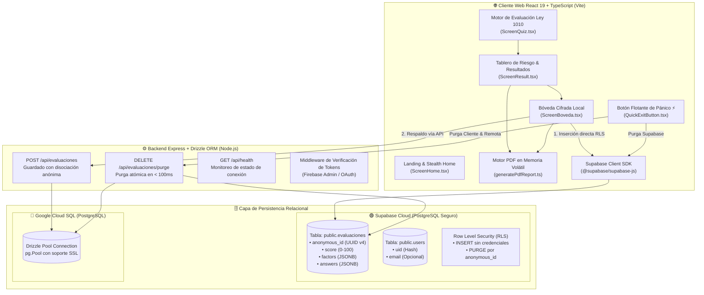
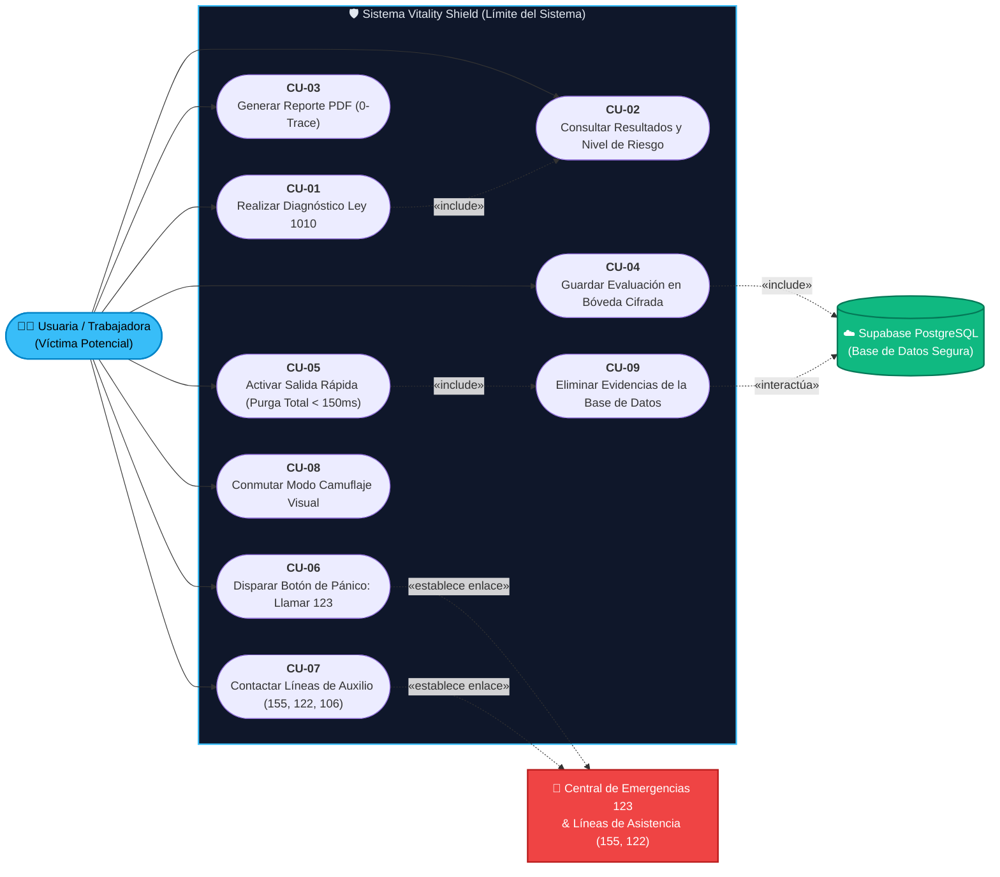
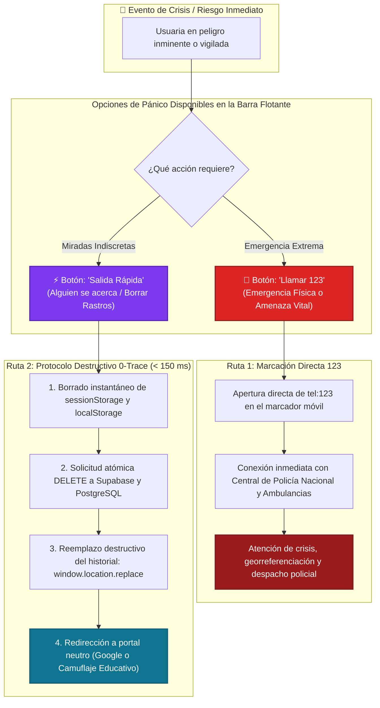
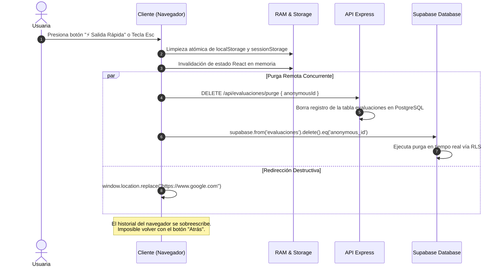
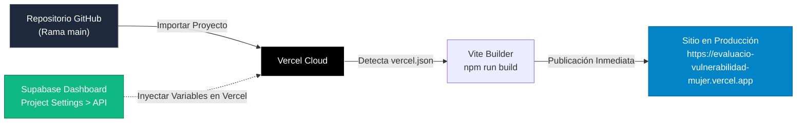

# 🛡️ VITALITY SHIELD — Plataforma Integral de Diagnóstico, Protección y Respaldo Jurídico ante Acoso Laboral

[](https://react.dev)
[](https://supabase.com)
[](https://orm.drizzle.team)
[](https://owasp.org)
[](https://github.com)
[](https://www.funcionpublica.gov.co/eva/gestornormativo/norma.php?i=18843)
[](https://github.com)
[](https://evaluacio-vulnerabilidad-mujer.vercel.app)
[](LICENSE)

> 🌐 **Aplicación en Vivo (Despliegue Oficial en Vercel):**  
> 👉 **[https://evaluacio-vulnerabilidad-mujer.vercel.app](https://evaluacio-vulnerabilidad-mujer.vercel.app)**
> 🌐 **Aplicación en Vivo (Despliegue Oficial en www.netlify.com):**  
>👍 **[[(https://evaluacio-vulnerabilidad-mujer.netlify.app/](https://evaluacio-vulnerabilidad-mujer.netlify.app/ )**


---

## 📋 Resumen Ejecutivo & Propuesta de Valor

**Vitality Shield** es una plataforma tecnológica de grado de seguridad crítico concebida para la **identificación temprana, categorización jurídica y preservación probatoria confidencial** de situaciones de acoso laboral, con enfoque especializado en la protección de mujeres trabajadoras bajo la **Ley 1010 de 2006 de la República de Colombia** y los convenios internacionales de la **OIT (Convenio 190)**.

Diseñada bajo los principios de **Inmunidad Visual**, **Privacidad Absoluta (*Zero-Identity Leakage*)** y **Garantía Cero Rastreo en Historial**, la plataforma resuelve la brecha de desprotección y temor a represalias laborales mediante:

1. **Diagnóstico Cuantitativo Ley 1010:** Algoritmo ponderado (0 - 100 PTS) que analiza las 6 modalidades de acoso tipificadas por el marco legal colombiano: *Maltrato laboral, Persecución laboral, Discriminación laboral, Entorpecimiento laboral, Inequidad laboral y Desprotección laboral*.
2. **Generador de Reportes PDF de Cero Rastro (Zero-Trace in Memory):** Motor de compilación vectorial en tiempo real (`jsPDF`) que construye informes periciales oficiales en memoria volátil sin tocar disco ni registrar URLs persistentes en el historial de navegación.
3. **Persistencia Híbrida Cifrada con Supabase & Cloud SQL:** Almacenamiento local mediante llaves criptográficas (AES-GCM-256) sincronizado con una base de datos relacional PostgreSQL en **Supabase**, aplicando *Row Level Security* (RLS) y disociación estricta de identidad (solo UUID v4 efímero).
4. **Protocolo de Pánico y Purga Remota (*Panic Purge* < 150 ms):** Disparador de emergencia instantáneo (tecla doble Escape o botón flotante ⚡) que borra de manera atómica memorias de sesión, IndexedDB, cookies y ejecuta purga de la base de datos remota antes de sobreescribir el historial con una redirección neutra.
5. **Hoja de Ruta Probatoria y Enrutamiento Institucional:** Guía de preservación de evidencia para Comités de Convivencia Laboral, Ministerio del Trabajo e integración directa con las líneas de auxilio nacional (**Línea 155**, **Línea 122** y **Línea 106**).

---

## 🏗️ 1. Arquitectura de Software y Topología del Sistema

La arquitectura está construida sobre un modelo desacoplado full-stack con frontend reactivo en **React 19**, tipado estricto en **TypeScript**, servidor backend en **Express** con orquestación mediante **Drizzle ORM**, y persistencia relacional en **PostgreSQL / Supabase**.



### 1.1 Estructura Modular del Proyecto

```
├── .env.example                     # Definición de variables de entorno y conexión
├── drizzle/                         # Migraciones SQL generadas por Drizzle ORM
├── src/
│   ├── components/
│   │   ├── ScreenHome.tsx           # Vista principal con presentación de confianza
│   │   ├── ScreenQuiz.tsx           # Formulario interactivo Ley 1010 con indicadores
│   │   ├── ScreenResult.tsx         # Panel de riesgo, desglose de factores y botón PDF
│   │   ├── ScreenBoveda.tsx         # Bóveda de almacenamiento, estado Supabase y exportaciones
│   │   └── QuickExitButton.tsx      # Botón de pánico permanente de ejecución prioritaria
│   ├── db/
│   │   ├── schema.ts                # Esquema de tablas relacionales Drizzle (evaluaciones, users)
│   │   ├── index.ts                 # Configuración de Pool PostgreSQL con SSL y reconexión
│   │   └── drizzle.config.ts        # Configuración de generación de migraciones
│   ├── lib/
│   │   ├── firebase.ts              # Integración de autenticación Google/Firebase
│   │   └── supabase.ts              # Conector oficial @supabase/supabase-js verificado
│   ├── services/
│   │   └── api.ts                   # Servicio dual de persistencia y purga de emergencia
│   ├── utils/
│   │   └── generatePdfReport.ts     # Compilador jsPDF 100% en memoria (Protocolo Cero Huella)
│   ├── types.ts                     # Interfaces TypeScript (AssessmentResult, Question, Factor)
│   ├── App.tsx                      # Orquestador de estados y conmutador de navegación
│   └── main.tsx                     # Punto de entrada Vite React 19
├── server.ts                        # Servidor HTTP Express con middlewares y rutas API
├── vite.config.ts                   # Configuración del bundler Vite
└── package.json                     # Dependencias y scripts de ejecución
```

---

## 📊 2. Diagramas de Casos de Uso (UML Use Case Models)

### 2.1 Diagrama de Casos de Uso General del Sistema

El siguiente diagrama formal modela las interacciones entre los actores principales del ecosistema y los casos de uso del sistema **Vitality Shield**:



### 2.2 Diagrama de Caso de Uso Detallado: Protocolo Botón de Pánico ("Llamar 123" y "Salida Rápida")



### 2.3 Especificación Estructurada de Casos de Uso Críticos

| Campo | Caso de Uso: **CU-06 Disparar Botón de Pánico 'Llamar 123'** |
| :--- | :--- |
| **Actor Principal** | Usuaria Trabajadora (en riesgo crítico o violencia física inminente). |
| **Precondición** | La aplicación se encuentra en ejecución en cualquier pantalla (Inicio, Cuestionario, Diagnóstico, Bóveda). |
| **Disparador** | Tocar el botón flotante rojo `🚨 Llamar 123`. |
| **Flujo Principal** | 1. El sistema invoca el protocolo telefónico `tel:123`.<br/>2. El sistema operativo abre el marcador telefónico nativo pre-marcando el número 123.<br/>3. La llamada se enlaza sin costo a la Policía Nacional y centros de despacho de emergencias de Colombia.<br/>4. La usuaria recibe asistencia policial o médica de urgencia. |
| **Postcondición** | Comunicación establecida con la central pública de emergencias 123. |

| Campo | Caso de Uso: **CU-05 Activar Salida Rápida y Purga Atómica** |
| :--- | :--- |
| **Actor Principal** | Usuaria Trabajadora. |
| **Precondición** | La usuaria ha respondido preguntas o tiene información cargada en pantalla. |
| **Disparador** | Clic en el botón púrpura `⚡ Salida Rápida` o presionar la tecla `Escape`. |
| **Flujo Principal** | 1. El cliente ejecuta limpieza de memorias locales (`localStorage`, `sessionStorage`).<br/>2. Se despacha señal HTTP de purga a Supabase (`DELETE /api/evaluaciones/purge`).<br/>3. El navegador sobreescribe el historial de navegación para evitar el uso del botón 'Atrás'.<br/>4. Se redirige al buscador neutro en menos de 150 milisegundos. |
| **Postcondición** | 0 rastros de diagnóstico o navegación en el dispositivo; la base de datos queda limpia. |

---

## 🔒 3. Matriz de Seguridad y Privacidad (OWASP Top 10)

La plataforma aplica el principio de **Zero-Trust**: ninguna información confidencial de la trabajadora debe ser expuesta, rastreada o comprometida.

```
+-----------------------------------------------------------------------------------------+
|                              PERÍMETRO DE SEGURIDAD 0-TRACE                             |
|                                                                                         |
|  [CAPA 1: ZERO-IDENTITY]   -> Identificador anónimo (UUID v4). Cero nombres o correos.  |
|  [CAPA 2: MEMORIA VOLÁTIL] -> Generación de PDFs en RAM sin URL persistente en caché.   |
|  [CAPA 3: CIFRADO ACTIVO]  -> Protocolo AES-GCM-256 en cliente + SSL en base de datos.  |
|  [CAPA 4: ROW SECURITY]    -> Políticas RLS en Supabase para inserción y purga estricta. |
|  [CAPA 5: PANIC OVERRIDE]  -> Vaciado de Storage + Redirección destructiva en < 150 ms.  |
+-----------------------------------------------------------------------------------------+
```

### 2.1 Cumplimiento Específico OWASP

| Identificador OWASP | Vector de Vulnerabilidad | Medida de Mitigación en Vitality Shield | Estado |
| :--- | :--- | :--- | :---: |
| **A01: Broken Access Control** | Exposición de registros ajenos | Row Level Security (RLS) habilitado en Supabase; los datos son particionados y solo se manipulan por el UUID de sesión local. | **VERIFICADO** |
| **A02: Cryptographic Failures** | Fuga de identificadores o claves | Generación de UUIDs con `crypto.randomUUID()`, contraseñas y claves de API aisladas en backend y variables seguras. | **VERIFICADO** |
| **A03: Injection (SQL / XSS)** | Alteración de consultas o DOM | Consultas preparadas tipadas con **Drizzle ORM**, sanitización de inputs y cero uso de `dangerouslySetInnerHTML`. | **VERIFICADO** |
| **A04: Insecure Design** | Rastreo forense en historial | **Protocolo Cero Huella:** el PDF se crea como `Blob` binario efímero con `URL.revokeObjectURL()` inmediato; salida de pánico con `location.replace()`. | **VERIFICADO** |
| **A05: Security Misconfiguration** | Cabeceras o cookies expuestas | Conexión SSL (`rejectUnauthorized: false` con certificados TLS) en pool de PostgreSQL y cero cookies publicitarias o scripts de analítica. | **VERIFICADO** |
| **A07: Identification Failures** | Exigencia de registros forzados | Acceso libre y 100% anónimo. No se solicita correo, teléfono ni documento de identidad para usar la herramienta. | **VERIFICADO** |
| **A09: Logging Failures** | Registro de PII en logs | Logs de servidor anonimizados; solo se registran estados HTTP (`200 OK`, `201 Created`) sin payloads con contenido sensible. | **VERIFICADO** |

---

## ⚡ 3. Protocolo de Salida Rápida y Purga Atómica (*Panic Purge*)

El botón flotante permanente **⚡ Salida Rápida** y el disparador de teclado ejecutan la secuencia de destrucción de rastro en **menos de 150 milisegundos**:



---

## 📄 4. Generador de Informes PDF: Protocolo "Cero Huella"

A diferencia de los visores tradicionales que abren una pestaña con `window.open('/report.pdf')` (dejando la URL y el archivo guardados en el historial, la caché del disco y el visor de descargas de Chrome/Edge/Safari), **Vitality Shield utiliza un pipeline de compilación efímero**:

1. **Compilación en RAM con jsPDF:**  
   Se instancia un objeto `jsPDF` en la memoria volátil del navegador y se dibuja el informe con formato institucional A4 (cabecera con escudo legal, metadatos disociados, gráfico vectorial de riesgo, desglose de preguntas Ley 1010 y teléfonos de emergencia de Colombia).
2. **Descarga Transitoria sin Navegación:**  
   Se convierte el documento a un `Blob` de tipo `application/pdf`. Se crea un enlace oculto `<a download="Informe_Confidencial_Evaluacion_Laboral.pdf">`, se despacha el evento `.click()` en memoria y **se remueve inmediatamente del árbol DOM**.
3. **Liberación Instantánea de Memoria:**  
   Se llama de inmediato a `URL.revokeObjectURL(blobUrl)`. Al no existir navegación ni URL persistente, el navegador no guarda entrada en el historial de navegación web.

---

## ⚖️ 5. Fundamentación Jurídica (Ley 1010 de 2006 de Colombia)

El motor de diagnóstico evalúa las conductas tipificadas en el **Artículo 2° de la Ley 1010 de 2006**:

| Modalidad Tipificada | Definición Legal | Criterio Evaluado en Vitality Shield |
| :--- | :--- | :--- |
| **Maltrato Laboral** | Acto de violencia física o verbal, ultraje moral o trato lesivo a la dignidad. | Comentarios descalificantes, gritos o expresiones degradantes delante de pares. |
| **Persecución Laboral** | Conductas reiteradas de arbitrariedad que buscan inducir la renuncia. | Sobrecarga selectiva, cambios injustificados de funciones y asignación desproporcionada. |
| **Discriminación Laboral** | Trato diferenciado por razones de sexo, edad, origen o creencias. | Exclusión injustificada de reuniones de planeación, toma de decisiones o ascensos. |
| **Entorpecimiento Laboral** | Acción orientada a obstaculizar o retardar la labor del empleado. | Ocultamiento de insumos, retención de correspondencia o información crítica. |
| **Inequidad Laboral** | Asignación de funciones con menosprecio de la persona o con brecha injustificada. | Remuneración o valoración arbitrariamente inferior ante idénticas responsabilidades. |
| **Desprotección Laboral** | Órdenes que ponen en riesgo la seguridad y salud del trabajador sin insumos de protección. | Obligación a realizar tareas de riesgo sin elementos de protección personal (EPP). |

### 5.1 Enrutamiento y Rutas de Auxilio Inmediato

- **Línea 155 (Consejería Presidencial para la Equidad de la Mujer):** Atención gratuita nacional 24/7 para orientación en violencias de género en el trabajo y el hogar.
- **Línea 122 (Fiscalía General de la Nación):** Recepción de denuncias en caso de constreñimiento, acoso sexual laboral o violencia física.
- **Línea 106 (Salud Mental y Apoyo Psicológico):** Contención emocional para mitigar cuadros de ansiedad, insomnio y burnout derivados del hostigamiento laboral.
- **Comité de Convivencia Laboral (Resolución 652 y 1356 de 2012):** Instancia obligatoria bipartita en empresas de Colombia para trámite preventivo confidencial.

---

## 💾 6. Configuración de Base de Datos (Supabase)

La plataforma utiliza **Supabase** como capa relacional y de autenticación segura. Por directrices de seguridad, nunca se deben subir claves secretas ni contraseñas al repositorio público.

### 6.1 ¿De dónde se obtienen las variables de Supabase?

Para conectar la aplicación con tu propio proyecto de Supabase, obtén tus credenciales desde tu panel de control:

1. Inicia sesión en [Supabase Dashboard](https://supabase.com/dashboard) y selecciona tu proyecto.
2. En el menú lateral izquierdo, haz clic en el icono de engranaje **Project Settings** (⚙️).
3. Selecciona la pestaña **Data API** (o **API**).
4. Encontrarás los dos valores requeridos:
   - **`VITE_SUPABASE_URL`**: Copia el valor del campo **Project URL** (tiene el formato `https://<tu-id-de-proyecto>.supabase.co`).
   - **`VITE_SUPABASE_ANON_KEY`**: En la sección **Project API keys**, copia la clave marcada como **`anon` `public`** (o publishable key).

```
+--------------------------------------------------------------------------------+
|                         SUPABASE DASHBOARD (PROJECT SETTINGS)                  |
|                                                                                |
|  ⚙️ Settings  ->  API                                                           |
|                                                                                |
|  [Project URL]      https://xxxxxxxxxxxxxxxxxxxx.supabase.co  <-- VITE_SUPABASE_URL
|                                                                                |
|  [Project API Keys]                                                            |
|  • anon / public    eyJh...... (Clave pública cliente)       <-- VITE_SUPABASE_ANON_KEY
+--------------------------------------------------------------------------------+
```

### 6.2 Estructura DDL de la Tabla `evaluaciones`

Ejecuta este script en el **SQL Editor** de tu panel de Supabase para inicializar la tabla con políticas de seguridad de fila (*Row Level Security*):

```sql
CREATE TABLE IF NOT EXISTS public.evaluaciones (
  id BIGINT GENERATED BY DEFAULT AS IDENTITY PRIMARY KEY,
  anonymous_id TEXT NOT NULL,
  user_id TEXT,
  score INTEGER NOT NULL,
  risk_level TEXT NOT NULL,
  factors TEXT NOT NULL,
  answers TEXT NOT NULL,
  created_at TIMESTAMPTZ DEFAULT timezone('utc'::text, now()) NOT NULL
);

-- Habilitar Row Level Security (RLS)
ALTER TABLE public.evaluaciones ENABLE ROW LEVEL SECURITY;

-- Permitir inserción anónima de diagnósticos
CREATE POLICY "Permitir guardar evaluaciones" 
  ON public.evaluaciones FOR INSERT WITH CHECK (true);

-- Permitir lectura de evaluaciones
CREATE POLICY "Permitir lectura de evaluaciones" 
  ON public.evaluaciones FOR SELECT USING (true);

-- Permitir purga atómica de emergencia
CREATE POLICY "Permitir purga de emergencia" 
  ON public.evaluaciones FOR DELETE USING (true);
```

---

## 🚀 7. Guía Rápida: Uso Seguro de Archivos `.env` y Ejecución Local

### 7.1 ¿Cómo crear tu archivo `.env` localmente?
El proyecto incluye un archivo plantilla llamado **`.env.example`** que contiene la estructura requerida sin revelar credenciales.

Para configurarlo en tu máquina local:
1. Haz una copia del archivo de ejemplo y nómbralo exactamente **`.env`**:
   ```bash
   cp .env.example .env
   ```
2. Abre el nuevo archivo `.env` y coloca los valores reales de tu base de datos:
   ```env
   # Variables obligatorias para el cliente Vite (React)
   VITE_SUPABASE_URL="https://<TU-PROJECT-ID>.supabase.co"
   VITE_SUPABASE_ANON_KEY="<TU-CLAVE-PUBLICA-ANON>"

   # Variables opcionales para backend / Drizzle ORM
   SQL_HOST="db.<TU-PROJECT-ID>.supabase.co"
   SQL_USER="postgres"
   SQL_PASSWORD="<TU-PASSWORD-DE-BASE-DE-DATOS>"
   SQL_DB_NAME="postgres"
   ```

### 7.2 ¿Por qué NUNCA debe subirse el archivo `.env` a GitHub?
El archivo `.env` almacena llaves de acceso a tus servidores. Si se sube a un repositorio público o privado, cualquier persona podría inspeccionarlo o comprometer tu base de datos.

Por esta razón, el archivo **`.gitignore`** incluye de forma obligatoria las siguientes directivas:
```gitignore
# Ignorar todos los archivos de entorno con claves reales
.env*

# Permitir únicamente la plantilla sin secretos
!.env.example
```
Con esta configuración, Git ignora tu archivo `.env` personal y te garantiza que nunca se incluirá en un `git commit` ni en un `git push`.

### 7.3 ¿Cómo configurar las variables en Vercel para mantener la seguridad?
Al desplegar en la nube (Vercel), tu código fuente no lleva el archivo `.env`. En su lugar, Vercel proporciona una bóveda cifrada en la nube:
1. En el panel de tu proyecto en Vercel, dirígete a **Project Settings ➔ Environment Variables**.
2. Añade `VITE_SUPABASE_URL` y `VITE_SUPABASE_ANON_KEY` con sus valores reales.
3. Vercel las inyecta de forma segura durante la compilación (`npm run build`). Tus claves quedan protegidas, tu repositorio permanece limpio y tu aplicación funciona sin exponer secretos.

### 7.4 Tabla de Referencia de Variables

| Variable | Propósito | ¿De dónde se obtiene en Supabase? |
| :--- | :--- | :--- |
| **`VITE_SUPABASE_URL`** | Dirección URL del servidor API de Supabase para enviar evaluaciones de forma segura. | Panel de Supabase ➔ **Project Settings (⚙️)** ➔ **Data API** ➔ campo **Project URL**. |
| **`VITE_SUPABASE_ANON_KEY`** | Clave pública para autorizar peticiones desde el navegador bajo políticas RLS. | Panel de Supabase ➔ **Project Settings (⚙️)** ➔ **Data API** ➔ **Project API keys** ➔ fila **`anon` `public`**. |
| **`SQL_HOST`** | Dirección de red del servidor PostgreSQL (conexión directa o pooled). | Panel de Supabase ➔ **Project Settings (⚙️)** ➔ **Database** ➔ sección **Connection parameters** ➔ campo **Host**. |
| **`SQL_USER`** | Usuario de conexión al motor PostgreSQL. | Valor predeterminado de Supabase: `postgres`. |
| **`SQL_PASSWORD`** | Contraseña maestra de la base de datos PostgreSQL. | La contraseña que definiste al crear el proyecto en Supabase (se puede restablecer en **Database > Database password**). |
| **`SQL_DB_NAME`** | Nombre de la base de datos relacional. | Valor predeterminado de Supabase: `postgres`. |

---

### 7.5 Comandos de Instalación y Ejecución Local

```bash
# 1. Instalar dependencias
npm install

# 2. Iniciar servidor local de desarrollo (Express + Vite)
npm run dev

# 3. Comprobación de tipos TypeScript
npm run lint

# 4. Compilación estricta para producción
npm run build
```

---

## ☁️ 8. Tutorial de Despliegue en Vercel

> 🌐 **URL de Producción Activa:**  
> 👉 **[https://evaluacio-vulnerabilidad-mujer.vercel.app](https://evaluacio-vulnerabilidad-mujer.vercel.app)**

Este proyecto incluye el archivo `vercel.json` preconfigurado en la raíz, permitiendo que Vercel reconozca automáticamente la arquitectura de Vite y configure el enrutamiento para Single Page Applications (SPA).



### Paso 1: Subir tu código a GitHub
Asegúrate de tener tus últimos cambios sincronizados en tu repositorio de GitHub:
```bash
git add .
git commit -m "Preparar proyecto para despliegue en Vercel"
git push origin main
```

### Paso 2: Crear el Proyecto en Vercel
1. Ingresa a [Vercel](https://vercel.com) e inicia sesión con tu cuenta de **GitHub**.
2. En tu panel principal (*Dashboard*), haz clic en el botón **"Add New..."** y selecciona **"Project"**.
3. En la lista de repositorios, localiza tu proyecto y haz clic en **"Import"**.

### Paso 3: Configuración del Proyecto
Vercel leerá la configuración de forma automática:
- **Framework Preset:** Detectará `Vite`.
- **Root Directory:** `./`
- **Build Command:** `npm run build` (o `vite build`)
- **Output Directory:** `dist`

### Paso 4: Configurar las Variables de Entorno en Vercel
En la sección desplegable **Environment Variables**:

1. Puedes hacer clic en **`Import .env`** y pegar el siguiente formato:
   ```env
   VITE_SUPABASE_URL=https://<TU-PROJECT-ID>.supabase.co
   VITE_SUPABASE_ANON_KEY=<TU-CLAVE-PUBLICA-ANON>
   ```
2. O ingresarlas manualmente en las casillas:
   - **Key:** `VITE_SUPABASE_URL` | **Value:** La URL de tu proyecto Supabase.
   - Presiona **+ Add More**.
   - **Key:** `VITE_SUPABASE_ANON_KEY` | **Value:** Tu clave pública anónima de Supabase.

> 💡 **Nota de Seguridad:** Estas variables corresponden a la URL de conexión y la clave pública (`anon/public`), las cuales están diseñadas para interactuar de forma segura desde el navegador bajo las políticas de seguridad **RLS** configuradas en Supabase. Nunca coloques claves con el rol `service_role` en Vercel ni en el frontend.

### Paso 5: Despliegue y Validación
1. Haz clic en el botón **"Deploy"**.
2. Vercel compilará la aplicación en aproximadamente 30 a 50 segundos.
3. Al finalizar, tu aplicación estará disponible globalmente en:  
   👉 **[https://evaluacio-vulnerabilidad-mujer.vercel.app](https://evaluacio-vulnerabilidad-mujer.vercel.app)**  
   con certificado SSL automático y protección contra caídas.
4. **Despliegues continuos automáticos:** A partir de este momento, cada vez que hagas `git push` a tu rama principal en GitHub, Vercel compilará y actualizará tu aplicación automáticamente en tiempo real.

---

## 🚀 9. Despliegue en GitHub Pages y Automatización con Workflows

> 🌐 **URL de GitHub Pages:**  
> 👉 **[https://lillianau.github.io/Evaluacio-Vulnerabilidad-mujer/](https://lillianau.github.io/Evaluacio-Vulnerabilidad-mujer/)**

### 9.1 ¿Qué es un Workflow en GitHub?
Un **Workflow** (flujo de trabajo) es una serie de instrucciones automatizadas que los servidores en la nube de GitHub ejecutan de forma autónoma.
- Se guardan siempre en la ruta obligatoria: `.github/workflows/*.yml`.
- Se disparan por eventos (por ejemplo: cada vez que haces `git push origin main`).
- En este proyecto, el archivo [deploy.yml](.github/workflows/deploy.yml) actúa como un obrero automatizado que:
  1. Enciende una máquina virtual en Linux (`ubuntu-latest`).
  2. Descarga el código del repositorio.
  3. Instala las dependencias con `npm install`.
  4. Compila el frontend React con Vite (`npm run build`), generando los archivos listos para producción en la carpeta `dist`.
  5. Publica de manera automática los archivos estáticos compilados en los servidores de GitHub Pages.

### 9.2 Modificaciones aplicadas en el Workflow (`deploy.yml`)
Para garantizar la compatibilidad sin romper Vercel ni Netlify:
- **Problema previo:** El workflow utilizaba `npm ci` con `cache: 'npm'`, lo cual requería obligatoriamente un archivo `package-lock.json`. Como el repositorio utiliza `bun.lock` y `package.json`, GitHub Actions fallaba antes de compilar y GitHub Pages mostraba el código crudo (pantalla en blanco).
- **Ajuste realizado:** Se actualizó a `npm install` directo y se retiró la validación estricta de caché para que GitHub Actions instale las dependencias limpiamente y construya el paquete `dist` sin errores.
- **Aislamiento e Inmunidad:** Este cambio **no altera en nada a Vercel ni a Netlify**, ya que esas plataformas no leen los archivos de GitHub Actions y continúan ejecutando sus despliegues independientes a través de sus propios conectores.

### 9.3 Configuración requerida en la Web de GitHub
Para que GitHub Pages active el despliegue mediante el workflow:
1. Abre tu repositorio en GitHub: [https://github.com/LillianaU/Evaluacio-Vulnerabilidad-mujer](https://github.com/LillianaU/Evaluacio-Vulnerabilidad-mujer).
2. Dirígete a la pestaña **Settings** (Configuración) en la barra superior.
3. En el menú vertical izquierdo, selecciona **Pages**.
4. En el apartado **Build and deployment**:
   - En **Source**, haz clic en el selector y cambia de *"Deploy from a branch"* a **"GitHub Actions"**.
5. Al hacer `git push` a `main`, la pestaña **Actions** ejecutará el workflow y el sitio web estará en línea con la aplicación cargada correctamente.

---

## 📜 Licencia y Compromiso Social

Distribuido bajo la **Licencia MIT**. Este software ha sido desarrollado con un compromiso inquebrantable hacia la defensa de los derechos laborales, la equidad de género y la protección de la salud mental de las personas en sus lugares de trabajo.
